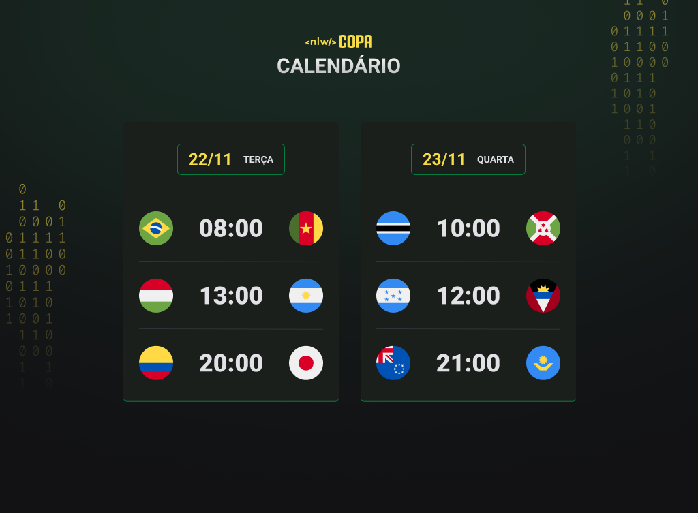

<h1 align="center"> Copa Calendar </h1>

Baseado no evento exclusivo e gratuito, promovido pela <a href="https://app.rocketseat.com.br/dashboard"> Rocketseat </a> para ensino de tecnologias WEB, porém idealizado com uma evolução no projeto.

  <a href="#-tecnologias">Tecnologias</a>&nbsp;&nbsp;&nbsp;|&nbsp;&nbsp;&nbsp;
  <a href="#-projeto">Projeto</a>&nbsp;&nbsp;&nbsp;|&nbsp;&nbsp;&nbsp;
  <a href="#memo-licença">Licença</a>

  

 

## 🚀 Tecnologias

Esse projeto foi desenvolvido com as seguintes tecnologias:

- HTML e CSS
- JavaScript e JSON
- Git e Github

## 💻 Projeto

O Calendario é um projeto focado na Copa de 2022, onde é possível adicionar máscara aos inputs e atualizar elementos HTML, que formulam os horários e datas dos jogos, via JS.

## Licença

Esse projeto está sob a licença MIT.

---
